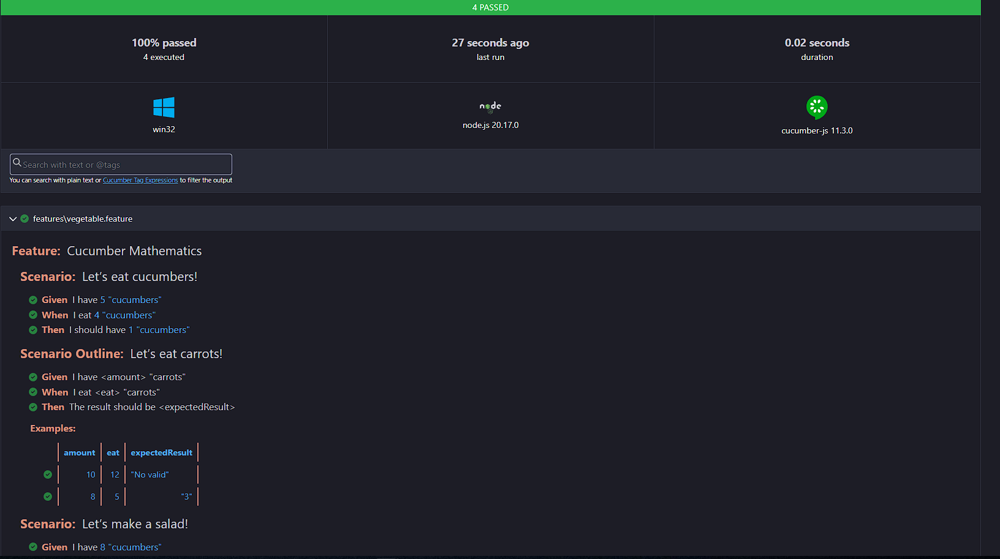

# Cucumber Test Automation Project

This project is set up to use **Cucumber** for behavior-driven development (BDD) testing in a **Node.js** environment. This README provides setup steps and guidance on how to execute tests.

---

## Table of Contents

* [Setup](#setup)
* [Execution](#execution)
* [Contact](#contact)

---

## Setup

### Prerequisites

* **Node.js**: Version >= 14.x
* **npm**: Node package manager (usually installed with Node.js)

### Steps to Install

1. **Clone the repository**:

   ```bash
   git clone https://github.com/eduardorojas06/CucumberMaths.git
   ```

2. **Navigate to the project directory**:

   ```bash
   cd cucumberMaths
   ```

3. **Install dependencies**:

   ```bash
   npm install
   ```

## Execution

### Running Tests

To run your Cucumber tests, use the following command:

```bash
npm test
```

This will execute all the scenarios defined in your **Feature Files** located in the `features` folder.


### HTML Report

HTML report is generated automatically after each execution. In order to see the cucumber_report.html go to reports folder

Report must looks like this example:

---

## Acknowledgements

* **Cucumber.js**: A powerful tool for behavior-driven development.
* **Chai**: For easy assertions in the step definitions.

---

## Contact

If you have any questions or suggestions, feel free to reach out to the project maintainer:

* **Name**: Eduardo Rojas Campos
* **Email**: [eduardorojascampos@gmial.com](mailto:eduardorojascampos@gmial.com)
* **GitHub**: [eduardorojas06](https://github.com/eduardorojas06)

---

